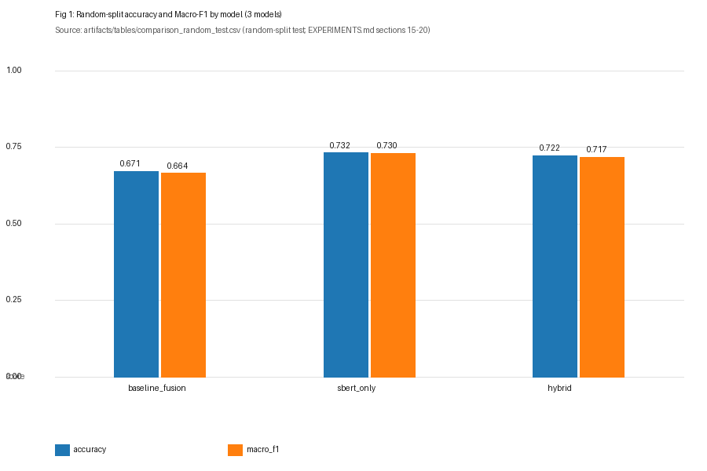
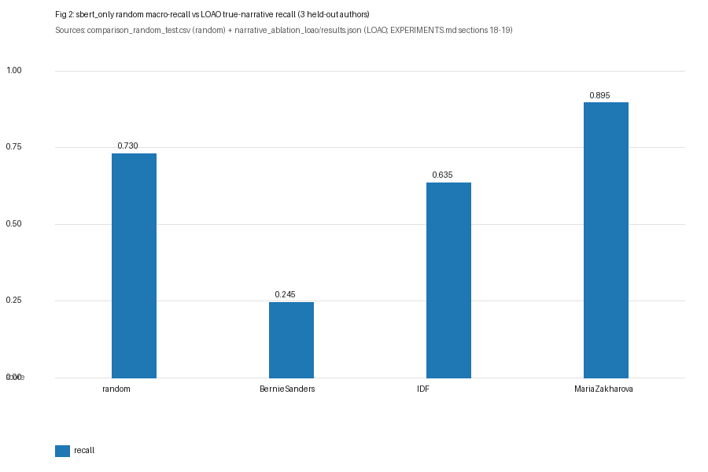
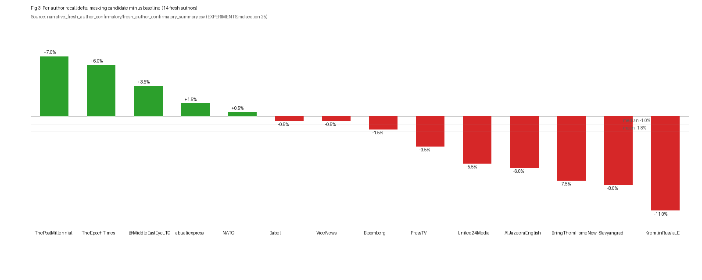
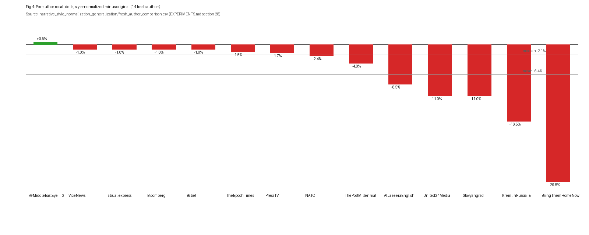

# Thesis Figures (all from measured artifacts)

Generated by `scripts/make_thesis_figures.py`, which reads ONLY the source
files listed per figure (stdlib + Pillow for rendering; no matplotlib in
this environment, no installs). No values are synthesized.

Note on random-split source: `artifacts/tables/model_comparison_results.json`
was unavailable at generation time, so `artifacts/tables/comparison_random_test.csv`
is used as the random-split source throughout (same numbers, CSV form).

## Fig 1: Random-split accuracy and Macro-F1, 3 models

Source: `artifacts/tables/comparison_random_test.csv` (EXPERIMENTS.md sections 15-20).
Takeaway: sbert_only leads on both accuracy (0.732) and Macro-F1 (0.730),
ahead of hybrid (0.722/0.717) and baseline_fusion (0.671/0.664).

## Fig 2: Random vs LOAO recall drop (sbert_only)

Sources: `artifacts/tables/comparison_random_test.csv` (random macro-recall
0.730) and `artifacts/experiments/narrative_ablation_loao/results.json`
(LOAO true-narrative recall; EXPERIMENTS.md sections 18-19).
Takeaway: generalization collapses unevenly by held-out author, from 0.895
(MariaZakharova) to 0.245 (BernieSanders), mean 0.592, against a 0.730
random-split baseline.

## Fig 3: Section 25 masking delta on 14 fresh authors

Source: `artifacts/experiments/narrative_fresh_author_confirmatory/fresh_author_confirmatory_summary.csv`
(candidate `sbert_person_misc_masked_aug_soft_topic` minus baseline
`sbert_original`; EXPERIMENTS.md section 25).
Takeaway: the masking candidate does not replicate on fresh authors, mean
per-author delta -1.8pp (section 25 reports baseline mean 39.0% vs candidate
37.1%), consistent with the pre-registered NON-INFERIOR = FALSE verdict.

## Fig 4: Section 28 style-normalization delta on 14 fresh authors

Source: `artifacts/experiments/narrative_style_normalization_generalization/fresh_author_comparison.csv`
(normalized minus original; EXPERIMENTS.md section 28).
Takeaway: normalization hurts unseen-author recall for 13/14 authors, mean
per-author delta -6.4pp (matches section 28); only `@MiddleEastEye_TG`
improves (+0.5pp). Figure overlays show the mean/median of per-author
deltas; section 28's reported median difference (-10.8pp) is the difference
of group medians, a different statistic pointing the same direction.
